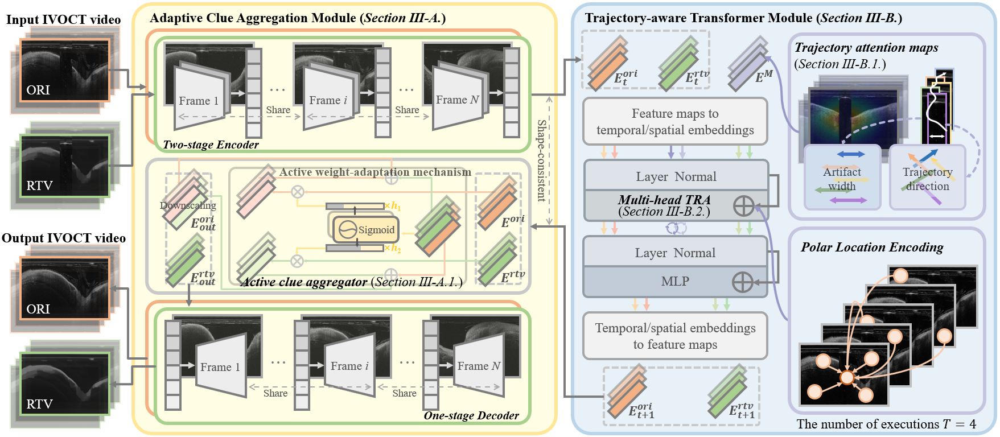

# Trajectory-Aware Adaptive Imaging Clue Analysis for Guidewire Artifact Removal in Intravascular Optical Coherence Tomography


The implementation of our paper ["Trajectory-Aware Adaptive Imaging Clue Analysis for Guidewire Artifact Removal in Intravascular Optical Coherence Tomography"](https://ieeexplore.ieee.org/abstract/document/10159446).

## Abstract
Guidewire Artifact Removal (GAR) involves restoring missing imaging signals in areas of IntraVascular Optical Coherence Tomography (IVOCT) videos affected by guidewire artifacts. We propose a reliable Trajectory-aware Adaptive imaging Clue analysis Network (TAC-Net) to restore the actual vascular and lesion information within the artifact area

<p align="center">
    
</p>

## Overview
- TAC-Net provides high-fidelity image reconstruction, improving the negative effects of guidewire artifacts, addressing the imaging defects in IVOCT, and eliminating the impact of missing signals.

- Adaptive clue aggregation balances texture-structure clues using active weight control in a parallel architecture, resulting in the realistic restoration of subtle textures and variable structures.

- Trajectory-aware Transformer effectively extracts highly artifact-related features by mining self-attention distributions, while avoiding the interference of unpredictable artifact trajectories.

<p align="center">
    
</p>

## Requirements  

Python `3.6`, PyTorch `1.6` and other common packages are listed in [`requirements.txt`](requirements.txt)


## Citation

Please consider citing the project in your publications if it helps your research. The following is a BibTeX reference. The BibTeX entry  requires the `url` LaTeX package.

```latex
@article{luo2023trajectory,
  title={Trajectory-aware Adaptive Imaging Clue Analysis for Guidewire Artifact Removal in Intravascular Optical Coherence Tomography},
  author={Luo, Gongning and Ma, Xinghua and Guo, Jinwen and Zou, Mingye and Wang, Wei and Cao, Yang and Wang, Kuanquan and Li, Shuo},
  journal={IEEE Journal of Biomedical and Health Informatics},
  year={2023},
  publisher={IEEE}
}
```

## Acknowledgment

https://github.com/guchengxi1994/RTV-in-Python